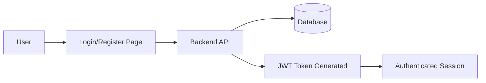
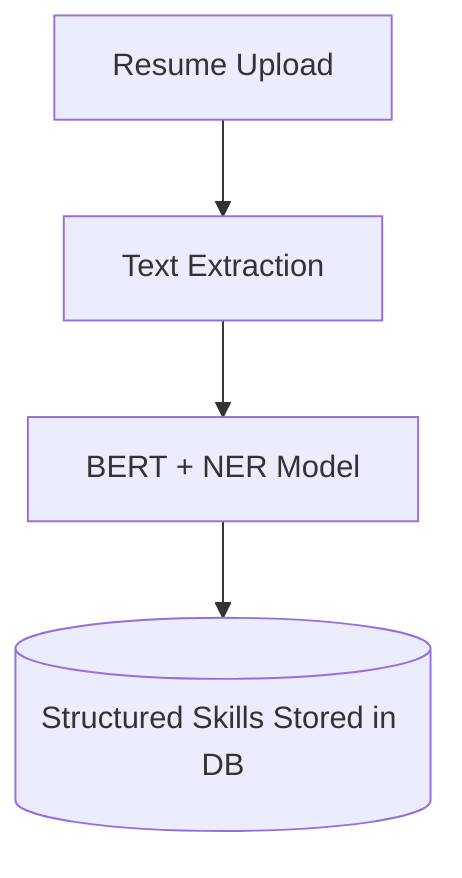
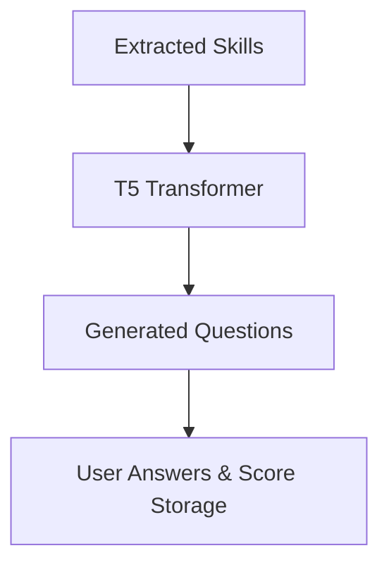
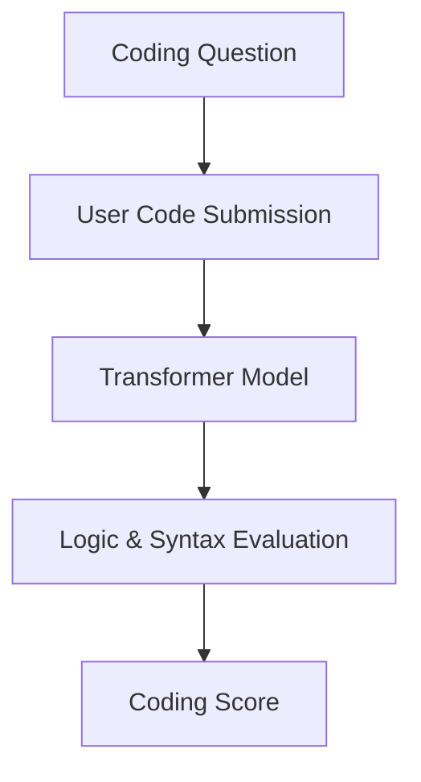
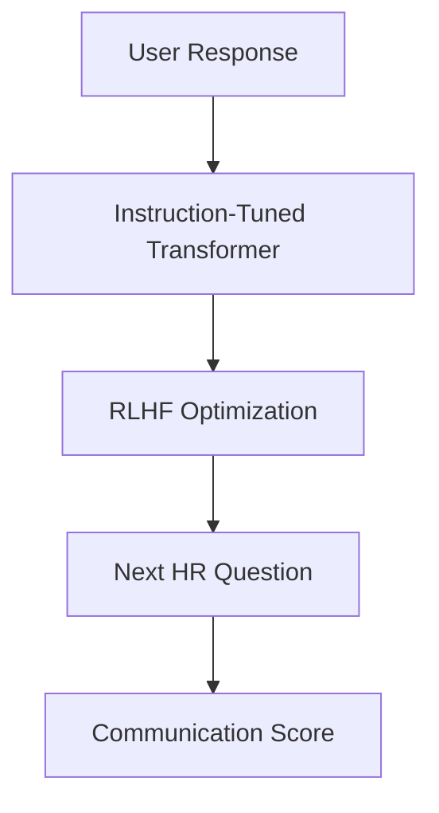
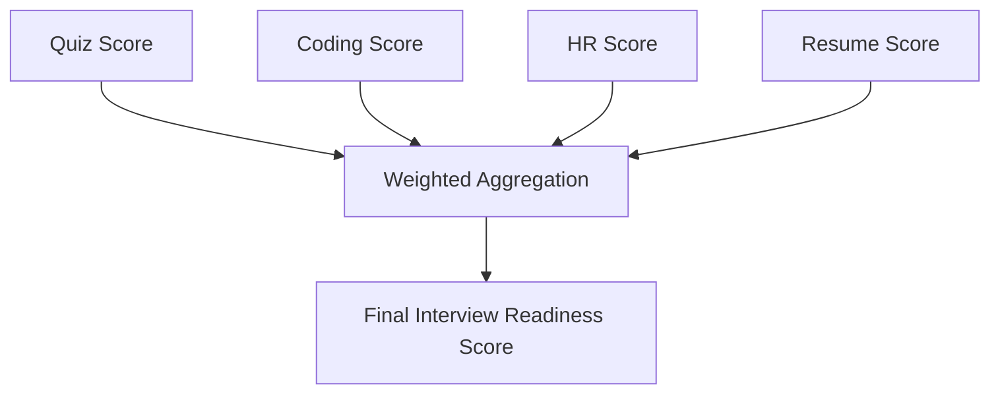
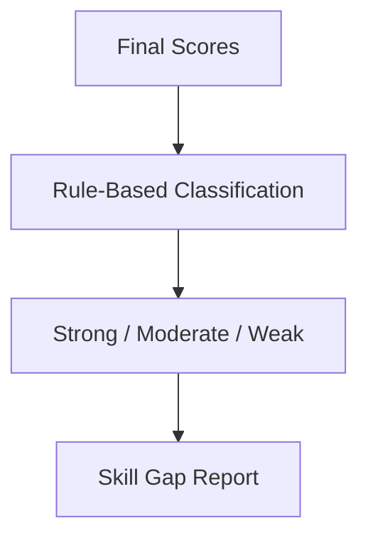
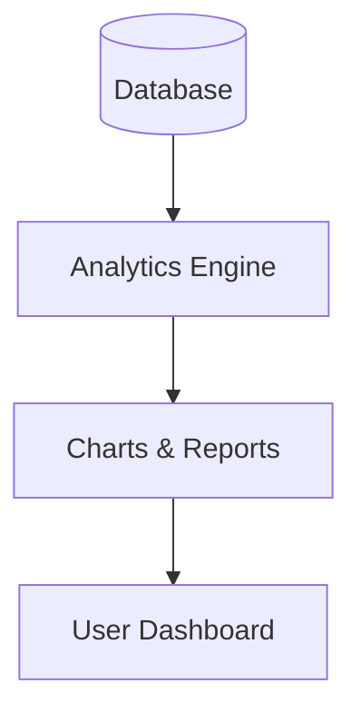

# Skill Mind AI: Technical Specifications

This document outlines the theoretical grounding, mathematical models, and architectural modules powering the Skill Mind AI platform.

---

## 🔐 1. User Management Module
**Key Functions**: Registration, Secure Login, JWT Auth, Session Management, Role-Based Access Control (RBAC).

### Module Diagram

---

## 🧠 2. Resume Analysis Module
**Algorithm**: BERT + Named Entity Recognition (NER)
**Key Functions**: Upload (PDF/TXT), Text Extraction, BERT (NER) for Skills/Ed/Exp, Structured Storage.

### Module Diagram

### Self-Attention Equation
$$Attention(Q, K, V) = \text{softmax}\left(\frac{QK^T}{\sqrt{d_k}}\right)V$$

---

## 🧠 3. Quiz Generation Module
**Algorithm**: T5 (Text-to-Text Transformer)
**Key Functions**: Skill analysis, T5 Question generation, Real-time MCQ scoring.

### Module Diagram

### Encoder–Decoder Probability
$$P(Y|X) = \prod_{t=1}^{n} P(y_t | y_{<t}, X)$$

---

## 🧠 4. Coding Assessment Module
**Algorithm**: Transformer-Based Autoregressive Model
**Key Functions**: Question generation, Code input acceptance, Autoregressive evaluation, Syntax/Logic scoring.

### Module Diagram

---

## 🧠 5. AI HR Interview Module
**Algorithm**: Instruction-Tuned Transformer + RLHF
**Key Functions**: Face-to-face simulation, Context-aware conversation, Dynamic follow-ups, Communication evaluation.

### Module Diagram

---

## 📊 6. Evaluation & Scoring Module
**Key Functions**: Semantic Similarity (Cosine), Weighted Aggregation, Final Readiness Score.

### Module Diagram

### Weighted Aggregation Formula
$$\text{Final Score} = 0.3(Q) + 0.3(C) + 0.3(H) + 0.1(R)$$

---

## 📈 7. Skill Gap Prediction Module
**Key Functions**: Performance mapping, Weak/Strong identification, Threshold classification, Suggestions.

### Module Diagram

---

## 📱 8. Dashboard & Analytics Module
**Key Functions**: Readiness Score display, Progress tracking, Visual reports (Charts), Performance downloads.

### Module Diagram

